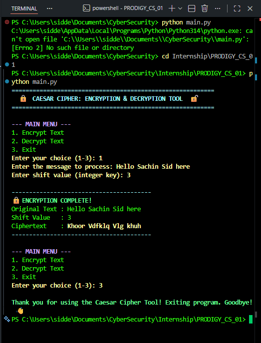
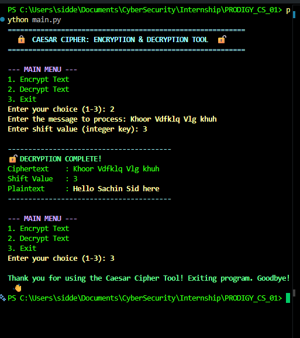
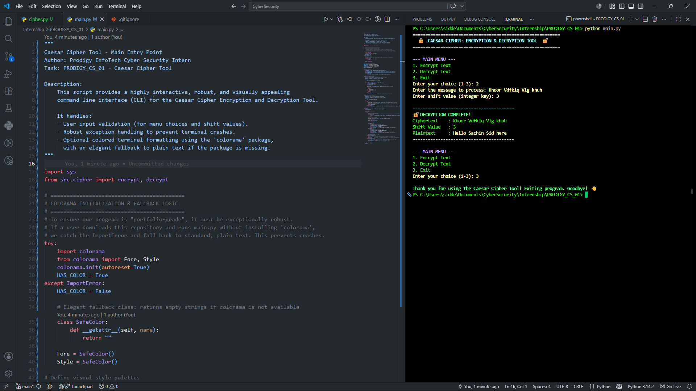

# Caesar Cipher Encryption & Decryption Tool
### 🎓 Prodigy InfoTech Cyber Security Internship — Task 01

[](https://www.python.org/)
[](https://opensource.org/licenses/MIT)
[](https://prodigyinfotech.dev/)

---

## 1. Overview
This repository contains a professional, highly interactive, and structurally modular **Caesar Cipher Encryption & Decryption Tool** written in Python 3. It was developed as **Task 01** of the **Prodigy InfoTech Cyber Security Internship**.

The Caesar Cipher is one of the earliest and simplest cryptographic techniques, where each letter in the plaintext is shifted down the alphabet by a fixed number of positions (known as the **Shift Key**). This tool demonstrates:
* Classical cryptography concepts (Plaintext, Ciphertext, and Shift Keys).
* Low-level ASCII character translation mechanics using Python's `ord()` and `chr()`.
* Mathematical modular arithmetic (`% 26`) for seamless alphabet wraparound.
* Defensive programming practices, rendering the command-line application crash-proof against invalid user entries.

---

## 2. Features
* **Dual Cryptographic Operations**: Easily encrypt raw plaintext messages or decrypt ciphertext strings back to readability.
* **Separation of Concerns**: Built in a clean modular project structure, separating algorithm logic (`src/cipher.py`) from user interface loops (`main.py`).
* **Preservation of Non-Alphabetic Characters**: Spaces, numbers, periods, punctuation, and special symbols are preserved exactly in their original indexes without modification.
* **Case Sensitivity**: Correctly processes uppercase (`A-Z`) and lowercase (`a-z`) letters individually, ensuring that capitalization is preserved post-transformation.
* **Dynamic Modulo Shifting**: Gracefully handles extremely large shift integers (e.g., $29$ is mapped to $3$ because $29 \pmod{26} = 3$) and negative values (shifting backwards).
* **Polished Interactive CLI**: Provides a vibrant command-line interface styled with color coding.
* **Graceful Crash Fallback**: Features an automated colorization fallback—if the `colorama` library is missing, the tool degrades gracefully to a plain-text interface rather than crashing.
* **Robust Exception Handling**: Employs continuous validation loops that prompt users until a correct input is provided.

---

## 3. Technologies Used
* **Python 3.8+**: The programming language used to construct the core algorithms and console loop.
* **Colorama (v0.4.6)**: Third-party library utilized to inject colorful styling (Fore, Style) into terminal streams, ensuring a clean and visually structured terminal interface.
* **Math/Modular Arithmetic**: Employs classical modulo systems to implement wrap-around letter logic.

---

## 4. Folder Structure
```text
PRODIGY_CS_01/
│
├── assets/
├── screenshots/
│   ├── encryption_output.png
│   ├── decryption_output.png
│   └── project_code.png
│
├── src/
│   └── cipher.py
│
├── .gitignore
├── main.py
├── README.md
└── requirements.txt
```

---

## 5. Installation Steps

### Prerequisites
Ensure that **Python 3** is installed and mapped to your system's path.

### 1. Clone the Project
Open a terminal/command prompt and run:
```bash
git clone https://github.com/siddesh3448/PRODIGY_CS_01.git
cd PRODIGY_CS_01
```

### 2. Set Up a Virtual Environment (Recommended)
This keeps dependencies isolated:
```bash
# Windows
python -m venv venv
venv\Scripts\activate

# macOS / Linux
python3 -m venv venv
source venv/bin/activate
```

### 3. Install Dependencies
```bash
pip install -r requirements.txt
```

---

## 6. How to Run
Run the entrypoint file from the root directory of the project:
```bash
python main.py
```
*(If your terminal does not map python, try using `python3 main.py` or the Windows standard launcher `py main.py`)*

---

## 7. Example Output
Below are test logs demonstrating standard usage:

### Case 1: Text Encryption
```text
===== Caesar Cipher Tool =====
1. Encrypt Text
2. Decrypt Text
3. Exit
Enter your choice: 1

Enter the message to process: HELLO
Enter shift value (integer key): 3

----------------------------------------
🔒 ENCRYPTION COMPLETE!
Original Text : HELLO
Shift Value   : 3
Ciphertext    : KHOOR
----------------------------------------
```

### Case 2: Text Decryption
```text
===== Caesar Cipher Tool =====
1. Encrypt Text
2. Decrypt Text
3. Exit
Enter your choice: 2

Enter the message to process: KHOOR
Enter shift value (integer key): 3

----------------------------------------
🔓 DECRYPTION COMPLETE!
Ciphertext    : KHOOR
Shift Value   : 3
Plaintext     : HELLO
----------------------------------------
```

### Case 3: Symbols & Numbers Handling
* **Plaintext Message**: `Python 3.10 is Awesome!`
* **Shift Key**: `5`
* **Encrypted Ciphertext**: `Udymts 3.10 nx Fbjxtrj!` *(Punctuation, digits, and spaces are preserved)*

---

## 8. Project Screenshots

### Encryption Output


### Decryption Output


### Project Code Structure


---

## 9. Learning Outcomes
Developing this project provided valuable hands-on experience in:
* **Fundamental Cryptography**: Formulating classical symmetric transposition engines.
  * *Encryption*: $E_k(x) = (x + k) \pmod{26}$
  * *Decryption*: $D_k(x) = (x - k) \pmod{26}$
* **Low-Level Conversions**: Operating ASCII-boundary logic with `ord()` and `chr()`.
* **Defensive Program Architecting**: Writing sanitization checks to catch wrong choices, invalid float keys, and keyboard interruptions (`Ctrl+C`).
* **Modularity Best Practices**: Implementing clean separation of concerns to separate mathematical utility backends from command-line displays.

---

## 10. Future Improvements
Here are suggested enhancements to expand this tool:
1. **Brute Force Decryption Mode**: Develop a solver option that runs through all $25$ possible shift rotations to automatically decrypt ciphertext without knowing the key.
2. **Frequency Analysis Module**: Add a statistical solver that uses letter frequencies in the English language to automatically guess the shift key of longer texts.
3. **Advanced Cryptography Algorithms**: Incorporate multi-layered polyalphabetic ciphers, such as the Vigenère Cipher.
4. **Graphical User Interface (GUI)**: Upgrade the terminal menu to a responsive dashboard using Tkinter or PyQT.

---

## 11. Author Information
* **Name**: Siddesh Mallinath Mange
* **Role**: Cyber Security Intern at Prodigy InfoTech
* **LinkedIn**: https://www.linkedin.com/in/siddesh-mallinath-mange-a44689351/
* **GitHub**: https://github.com/siddesh3448

---

## 12. License & Citation
This project is licensed under the MIT License. Feel free to copy, modify, and distribute it for learning purposes.

If you are using this code for your Prodigy InfoTech internship submission, make sure to read the explanations inside the source comments to fully understand the logic!
